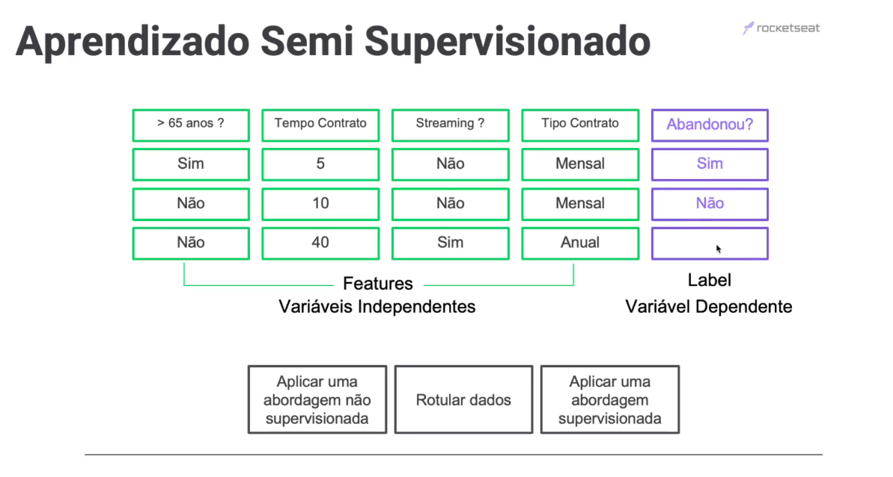

<!-- markdownlint-disable MD024 -->
<!-- markdownlint-disable MD033 -->

# Parte 1 - Conceitos Básicos

> [voltar](./notes.md) para página anterior.

## Sumário

- [Parte 1 - Conceitos Básicos](#parte-1---conceitos-básicos)
  - [Sumário](#sumário)
  - [O que é Aprendizado de Máquina?](#o-que-é-aprendizado-de-máquina)
    - [Material](#material)
    - [ChatGPT 3.5](#chatgpt-35)
  - [Tipos de Aprendizado](#tipos-de-aprendizado)
    - [Material](#material-1)
    - [ChatGPT 3.5](#chatgpt-35-1)
  - [Tipos de Algoritimo](#tipos-de-algoritimo)
    - [Material](#material-2)
    - [ChatGPT 3.5](#chatgpt-35-2)

## O que é Aprendizado de Máquina?

### Material

É um campo da Inteligência Artificial que trata do modo como os sistemas utilizam algoritimos e dados para simular a maneira de aprender dos seres humanos, com melhora gradual e continua por meio da experiência.

Os algorítimos que são construidos

### ChatGPT 3.5

Machine Learning, em português "Aprendizado de Máquina," é uma subárea da inteligência artificial (IA) que se concentra no desenvolvimento de algoritmos e modelos estatísticos que permitem que sistemas de computador aprendam e melhorem seu desempenho em tarefas específicas à medida que são expostos a mais dados. O objetivo principal do Machine Learning é capacitar os computadores a automatizar a aprendizagem sem serem explicitamente programados para tarefas específicas.

No Machine Learning, os sistemas são projetados para identificar padrões e fazer previsões com base em dados, aprimorando sua capacidade de realizar tarefas semelhantes no futuro. Para isso, são utilizados diversos algoritmos e técnicas, incluindo:

1. **Aprendizado supervisionado:** Nesse tipo de aprendizado, um modelo é treinado com um conjunto de dados de entrada (exemplos) e saídas correspondentes (rótulos) para aprender a mapear os inputs para as saídas. O objetivo é prever saídas para novos dados com base no conhecimento adquirido durante o treinamento.

2. **Aprendizado não supervisionado:** Aqui, o modelo é treinado com dados que não possuem rótulos ou categorias pré-definidas. O sistema deve descobrir padrões ou estruturas ocultas nos dados, como agrupamento (clustering) e redução de dimensionalidade.

3. **Aprendizado por reforço:** Nesse caso, um agente (por exemplo, um robô ou software) toma decisões sequenciais para maximizar uma recompensa cumulativa. O agente aprende através da tentativa e erro, recebendo feedback na forma de recompensas ou penalidades.

4. **Aprendizado profundo (Deep Learning):** É uma subárea do Machine Learning que utiliza redes neurais artificiais com múltiplas camadas (redes profundas) para aprender representações complexas de dados. O Deep Learning tem sido especialmente eficaz em tarefas de processamento de imagens, fala e linguagem natural.

Machine Learning é aplicado em uma ampla gama de campos e domínios, incluindo visão computacional, processamento de linguagem natural, diagnóstico médico, reconhecimento de padrões, finanças, automação industrial, veículos autônomos e muito mais. À medida que os algoritmos e as técnicas de Machine Learning continuam a evoluir, eles desempenham um papel cada vez mais importante em nossa sociedade, automatizando tarefas complexas e permitindo insights valiosos a partir de grandes volumes de dados.

> [voltar](#sumário) para o topo.

## Tipos de Aprendizado

### Material

- **Supervisinado**: Modelos são treinado usando um conjunto de dados rotulado, aprendendo a mapear entradas e saídas esperadas.

  

- **Não Supervisionado**: Modelos exploram dados não rotulados para identificar padrões ou estruturas subjacentes, como agrupamentos, associações ou redução de dimensionalidade.

  

- **Semi Supervisionado**: Combina dados rotulados e não rotulados para melhorar o desenpenho o modelo, geralmente utilizando a estrutura não rotulada para aprimorar o aprendizado supervisionado.

  

- **Por Reforço**: Agentes aprendem a tomar ações em um ambiente para maximizar algum tipo de recompensa acumulativa, através de tentativa e erro.

  

### ChatGPT 3.5

Existem três tipos principais de aprendizado em Machine Learning: aprendizado supervisionado, aprendizado não supervisionado e aprendizado por reforço. Cada um deles aborda a tarefa de aprendizado de maneira diferente. Aqui estão esses tipos em detalhes:

1. **Aprendizado Supervisionado:**
   - No aprendizado supervisionado, o modelo é treinado com um conjunto de dados de entrada e saída correspondente, onde os pares de entrada e saída são rotulados.
   - O objetivo é aprender uma função que mapeie os dados de entrada para os rótulos de saída.
   - Durante o treinamento, o modelo ajusta seus parâmetros com base na comparação entre as previsões feitas e os rótulos reais.
   - Após o treinamento, o modelo pode ser usado para fazer previsões em novos dados.
   - Exemplos de tarefas de aprendizado supervisionado incluem classificação (atribuir uma categoria a um dado), regressão (prever um valor contínuo), detecção de anomalias, entre outros.

2. **Aprendizado Não Supervisionado:**
   - No aprendizado não supervisionado, o modelo é treinado com um conjunto de dados de entrada, mas os dados não são rotulados com saídas correspondentes.
   - O objetivo é descobrir padrões intrínsecos nos dados, como agrupamentos (clustering) ou redução de dimensionalidade.
   - O aprendizado não supervisionado é frequentemente usado para explorar a estrutura oculta nos dados e identificar relações ou grupos naturais.
   - Exemplos de tarefas de aprendizado não supervisionado incluem agrupamento de documentos, análise de componentes principais (PCA), e redução de dimensionalidade.

3. **Aprendizado por Reforço:**
   - No aprendizado por reforço, um agente toma decisões sequenciais em um ambiente para maximizar uma recompensa cumulativa ao longo do tempo.
   - O agente aprende a tomar ações com base em tentativa e erro, recebendo feedback na forma de recompensas positivas ou penalidades negativas.
   - O objetivo é encontrar uma política de ação que maximize a recompensa ao longo do tempo.
   - O aprendizado por reforço é frequentemente usado em tarefas de tomada de decisão, como jogos, robótica, controle de tráfego e otimização de recursos.

Além desses três tipos principais, existem outras abordagens e técnicas de aprendizado em Machine Learning, como aprendizado semi-supervisionado, aprendizado por transferência, aprendizado profundo (Deep Learning), entre outros. A escolha do tipo de aprendizado a ser usado depende da natureza da tarefa e dos dados disponíveis. Cada tipo de aprendizado tem suas próprias aplicações e desafios.

> [voltar](#sumário) para o topo.

## Tipos de Algoritimo

### Material

  

 

- **Modelo `scikit-learn`:** Divisão de quatro classes de algorímitmos

  

### ChatGPT 3.5

Existem diversos algoritmos de Machine Learning, cada um projetado para abordar diferentes tipos de tarefas e cenários. Alguns dos tipos mais comuns de algoritmos de Machine Learning incluem:

1. **Regressão:**
   - Algoritmos de regressão são usados para prever valores numéricos com base em dados de entrada.
   - Exemplos incluem regressão linear, regressão polinomial, regressão de árvore de decisão e regressão de floresta aleatória.

2. **Classificação:**
   - Algoritmos de classificação são usados para atribuir categorias ou rótulos a dados de entrada.
   - Exemplos incluem classificação de regressão logística, classificação de máquina de vetores de suporte (SVM), classificação de árvore de decisão e classificação de redes neurais.

3. **Clustering:**
   - Algoritmos de clustering agrupam dados não rotulados em grupos com base em suas características semelhantes.
   - Exemplos incluem k-means, agrupamento hierárquico e DBSCAN.

4. **Redução de dimensionalidade:**
   - Algoritmos de redução de dimensionalidade são usados para reduzir a complexidade dos dados, mantendo as informações essenciais.
   - Exemplos incluem Análise de Componentes Principais (PCA) e T-Distributed Stochastic Neighbor Embedding (t-SNE).

5. **Aprendizado profundo (Deep Learning):**
   - Algoritmos de aprendizado profundo são baseados em redes neurais artificiais profundas com múltiplas camadas ocultas.
   - Exemplos incluem redes neurais convolucionais (CNNs) para visão computacional, redes neurais recorrentes (RNNs) para processamento de sequências e Redes Neurais de Transformadores (Transformers) para processamento de linguagem natural.

6. **Algoritmos de Árvore de Decisão:**
   - Algoritmos de árvore de decisão são usados para tomada de decisões com base em regras condicionais.
   - Exemplos incluem Árvores de Decisão, Floresta Aleatória e Gradient Boosting.

7. **Aprendizado por Reforço:**
   - Algoritmos de aprendizado por reforço são usados para treinar agentes a tomar decisões sequenciais para maximizar recompensas.
   - Exemplos incluem Q-Learning, DDPG (Deep Deterministic Policy Gradients) e A3C (Asynchronous Advantage Actor-Critic).

8. **Aprendizado Não Supervisionado:**
   - Algoritmos de aprendizado não supervisionado exploram padrões nos dados sem a necessidade de rótulos.
   - Exemplos incluem k-means, PCA e t-SNE, como mencionados anteriormente.

9. **Aprendizado Semi-Supervisionado:**
   - Algoritmos semi-supervisionados combinam dados rotulados e não rotulados para treinar modelos.
   - Exemplos incluem métodos de propagação de rótulos e autoencoders.

Esses são apenas alguns exemplos de tipos de algoritmos de Machine Learning. A escolha do algoritmo depende da natureza da tarefa, dos dados disponíveis e dos objetivos específicos do projeto. À medida que a pesquisa em Machine Learning avança, novos algoritmos e técnicas continuam a ser desenvolvidos para lidar com uma ampla gama de desafios.

> [voltar](#sumário) para o topo.
>
> [voltar](./notes.md) a página anterior.
