<!-- markdownlint-disable MD024 -->
<!-- markdownlint-disable MD033 -->

# Parte 2 - O cotidiano de projetos de IA/ML

> [voltar](./notes.md) para página anterior.

## Sumário

- [Parte 2 - O cotidiano de projetos de IA/ML](#parte-2---o-cotidiano-de-projetos-de-iaml)
  - [Sumário](#sumário)
  - [A maldição da dimensionalidade](#a-maldição-da-dimensionalidade)
    - [Material](#material)
    - [Conceito ChatGPT 3.5](#conceito-chatgpt-35)
  - [Engenharia e Seleção de *Features*](#engenharia-e-seleção-de-features)
    - [Material](#material-1)
    - [Conceito ChatGPT 3.5](#conceito-chatgpt-35-1)
  - [*Overfitting* e *Underfittig*](#overfitting-e-underfittig)
    - [Material](#material-2)
    - [Conceito ChatGPT 3.5](#conceito-chatgpt-35-2)
  - [Trade-off entre viés e variância](#trade-off-entre-viés-e-variância)
    - [Material](#material-3)
    - [Conceito ChatGPT 3.5](#conceito-chatgpt-35-3)
  - [Validação de Modelos](#validação-de-modelos)
    - [Material](#material-4)
      - [Grupos de Validação de Modelos](#grupos-de-validação-de-modelos)
      - [Exemplos de Técnicas de Validação de Modelos](#exemplos-de-técnicas-de-validação-de-modelos)
      - [Tipos de Métricas de Desempenho e de Negócios](#tipos-de-métricas-de-desempenho-e-de-negócios)
      - [Questões não funcionais](#questões-não-funcionais)
    - [Conceito ChatGPT 3.5](#conceito-chatgpt-35-4)

## A maldição da dimensionalidade

### Material

A **maldição da dimensionalidade** foi denominada pelo matemático R. Bellman em seu livro "Programação Dinâmica", em 1957. Essa maldição diz qua a quantidade de dados que você precisa, para alcançar o conhecimento desejado, impacta exponencialmente o número de atributos necessários.

Em resumo, refere-se a uma série de problemas que surgem ao trabalhar com dados de alta dimensão. A dimensão de um conjunto de dados corresponde ao número de características existens em um conjunto de dados.

- Demonstração:
  - *Gráfico 1:* o aumento de dimensões causa o distancimaneto entre os dados, dificultando a definição de modelos e padrões.
  - *Gráfico 2:* O número de *features*(variáveis) não pode ser ilimitado, sendo necessáio verificar o número ideal de variáveis com o poder computacional.

  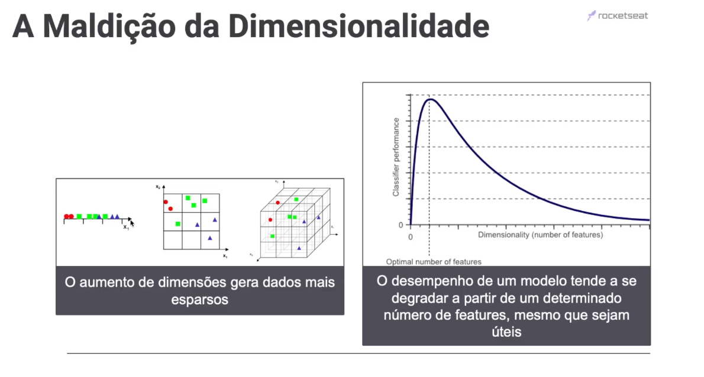

Como lidar com esse problema, então? A ideia é fazer uma seleção apurada da *features* e filtrar o números de dimensões para se evitar o espaçamento dos dados.

### Conceito ChatGPT 3.5

A "maldição da dimensionalidade" é um termo usado no contexto do aprendizado de máquina e da análise de dados para descrever os desafios que surgem quando lidamos com conjuntos de dados de alta dimensionalidade. Refere-se ao fato de que, à medida que o número de características ou dimensões em um conjunto de dados aumenta, vários problemas e dificuldades podem surgir, tornando a análise e o aprendizado de máquina mais complexos. Alguns dos principais desafios associados à maldição da dimensionalidade incluem:

**1. Esparsidade dos dados:** À medida que o número de dimensões aumenta, os pontos de dados em um espaço de alta dimensão tendem a se tornar mais esparsos. Isso significa que a maioria dos pontos de dados está distante uns dos outros, tornando mais difícil identificar padrões significativos.

**2. Aumento da complexidade computacional:** O processamento e a análise de dados de alta dimensão exigem mais recursos computacionais, o que pode tornar os algoritmos de aprendizado de máquina mais lentos e exigir mais memória.

**3. Overfitting:** Com um grande número de dimensões, os modelos de aprendizado de máquina têm maior probabilidade de se ajustar ao ruído nos dados, em vez de capturar os padrões reais. Isso pode levar a um superajuste (overfitting), onde o modelo não consegue generalizar bem para novos dados.

**4. Necessidade de mais dados:** À medida que a dimensionalidade aumenta, é necessário um número cada vez maior de dados para estimar adequadamente os parâmetros do modelo e reduzir o risco de overfitting.

**5. Redução de dimensionalidade:** Para lidar com a maldição da dimensionalidade, muitas vezes é necessário realizar técnicas de redução de dimensionalidade, como Análise de Componentes Principais (PCA) ou seleção de características, a fim de extrair as informações mais importantes e reduzir a dimensionalidade do conjunto de dados.

Espero que esta formatação com negrito torne os tópicos mais destacados. Se você tiver mais alguma pergunta ou precisar de esclarecimentos adicionais, sinta-se à vontade para perguntar.

A maldição da dimensionalidade é um desafio importante a ser enfrentado ao lidar com conjuntos de dados de alta dimensão, e os cientistas de dados e engenheiros de aprendizado de máquina frequentemente precisam adotar estratégias para mitigar seus efeitos e desenvolver modelos eficazes em tais ambientes.

> [voltar](#sumário) para o topo.

## Engenharia e Seleção de *Features*

### Material

Engenharia de *features* é uma etapa fundamental no processo de desenvolvimento de modelos de ***machine learning***. refere-se ao processo de selecionar, extrair, transformar ou criar novas vairáveis (*features*) a partir de dados brutos para melhorar o desempenho de modelos. Uma boa engenharia de *features* pode tornar um modelo mais preciso, eficiente e interpretável.

A engenharia de *features* é um **processo iterativo**. Os especialistas em IA/ML geralmente começam com um conjunto inicial de *features* e então testam diferentes combinações de *features* para determinar a melhor configuração para o modelo.

- *Ilustração*: etapas da Engenharia de *Features*

  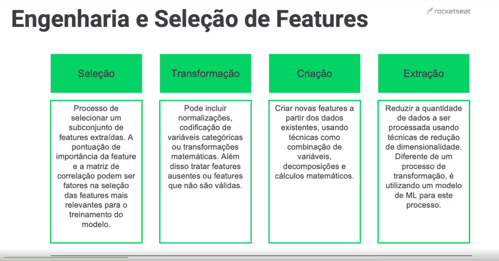

### Conceito ChatGPT 3.5

A "Engenharia de Features" (ou "Engenharia de Características") é um processo fundamental no campo de aprendizado de máquina (machine learning) que envolve a criação, transformação e seleção de características (variáveis) a partir dos dados brutos, a fim de melhorar o desempenho dos modelos de machine learning. As características, também chamadas de atributos ou variáveis, representam informações específicas que o modelo usa para fazer previsões ou classificações. Aqui está o conceito e as etapas típicas da Engenharia de Features:

**Conceito da Engenharia de Features:**
A Engenharia de Features é o processo de identificar, criar e modificar características relevantes a partir dos dados brutos, a fim de melhorar a capacidade do modelo de aprendizado de máquina de capturar padrões, fazer previsões precisas e generalizar bem para novos dados. É uma etapa crítica no desenvolvimento de modelos de machine learning, pois a qualidade e a relevância das características têm um grande impacto no desempenho do modelo.

**Etapas da Engenharia de Features:**

1. **Coleta de Dados:** A primeira etapa envolve a aquisição dos dados brutos. Isso pode incluir a coleta de dados de fontes diversas, como sensores, bancos de dados, arquivos CSV, etc.

2. **Análise Exploratória de Dados (EDA):** Antes de criar ou modificar características, é essencial realizar uma análise exploratória dos dados para entender sua estrutura, distribuição e identificar possíveis padrões iniciais. Isso ajuda na escolha das abordagens de engenharia de features mais adequadas.

3. **Seleção de Características:** Nesta etapa, você pode determinar quais características são mais relevantes para o problema em questão. A seleção de características envolve a escolha das características que mais contribuem para o desempenho do modelo e a remoção das características redundantes ou irrelevantes.

4. **Criação de Características:** Aqui, você pode criar novas características a partir das características existentes ou dos dados brutos. Isso pode incluir transformações matemáticas, combinação de características, extração de informações úteis, e assim por diante.

5. **Normalização e Padronização:** Em muitos casos, é importante normalizar ou padronizar as características para garantir que todas estejam na mesma escala, o que ajuda a evitar que algumas características dominem outras durante o treinamento do modelo.

6. **Lidar com Valores Ausentes:** Se houver valores ausentes nos dados, é necessário decidir como tratá-los, seja preenchendo-os com valores apropriados, removendo as instâncias correspondentes ou usando técnicas mais avançadas, como a imputação.

7. **Engenharia de Features Avançada:** Dependendo do problema, você pode aplicar técnicas avançadas, como redução de dimensionalidade (por exemplo, PCA), codificação de variáveis categóricas, criação de características de interação, entre outras.

8. **Avaliação e Iteração:** Após a engenharia de features, é importante avaliar o desempenho do modelo usando validação cruzada e métricas adequadas. Se o desempenho não for satisfatório, você pode iterar nas etapas anteriores, ajustando ou criando novas características, até obter resultados aceitáveis.

A Engenharia de Features é uma parte crucial do ciclo de desenvolvimento de modelos de machine learning, pois pode fazer a diferença entre um modelo com baixo desempenho e um modelo altamente eficaz. É importante adaptar as etapas de engenharia de features de acordo com o problema específico que você está abordando.

> [voltar](#sumário) para o topo.

## *Overfitting* e *Underfittig*

### Material

O *overfitting* e o *underfitting* são dois termos importantes no aprendizado supervisionado de machine learning. O *underfitting* ocorre quando o modelo é muito simples para aprender a relação entre as variáveis durante o treinamento, resultando em previsões imprecisas para novos dados. Já o *overfitting* ocorre quando o modelo se ajusta muito bem aos dados de treinamento, incluindo o ruído, mas não consegue generalizar para dados não vistos anteriormente. Existem técnicas para lidar com esses problemas, como a regularização, o uso de ensemble de modelos, a seleção de boas features e a redução da dimensionalidade dos dados. A validação cruzada também é uma técnica importante para evitar o *overfitting* e o *underfitting*.

- *Ilustração:* conceitos e modelos clássicos *under*, *optimum* e *overfit*

  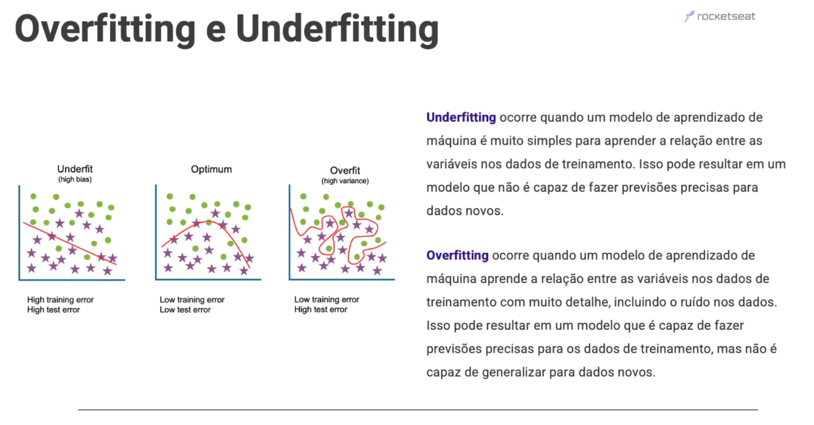

Como lidar *overfitting* e *underfittig*? Existem técnicas para lidar com esses problemas, como a regularização, o uso de ensemble de modelos, a seleção de boas features e a redução da dimensionalidade dos dados. A validação cruzada também é uma técnica importante para evitar o overfitting e o underfitting.

### Conceito ChatGPT 3.5

O overfitting e o underfitting são problemas comuns no treinamento de modelos de machine learning e referem-se a situações em que o modelo não é capaz de generalizar bem para novos dados. Aqui estão as estratégias típicas para lidar com esses dois problemas:

**Overfitting:**
O overfitting ocorre quando um modelo se ajusta excessivamente aos dados de treinamento, capturando o ruído nos dados em vez dos padrões reais. Isso resulta em um desempenho fraco em novos dados. Para lidar com o overfitting, você pode considerar as seguintes estratégias:

1. **Aumentar o tamanho do conjunto de dados:** Um conjunto de dados maior pode ajudar o modelo a aprender padrões mais gerais e reduzir o impacto do ruído nos dados.

2. **Regularização:** A regularização adiciona penalidades aos coeficientes do modelo para evitar que eles cresçam demais. Isso inclui técnicas como L1 (Lasso) e L2 (Ridge) para regressão linear, ou dropout em redes neurais.

3. **Seleção de Características:** Reduza o número de características no modelo, mantendo apenas as mais informativas. A seleção de características pode ajudar a evitar que o modelo se ajuste ao ruído.

4. **Cross-Validation:** Use validação cruzada para avaliar o desempenho do modelo em conjuntos de treinamento e teste diferentes. Isso ajuda a identificar se o modelo está superajustando os dados.

5. **Diminuir a complexidade do modelo:** Escolha modelos mais simples com menos parâmetros. Às vezes, modelos complexos, como redes neurais profundas, são mais suscetíveis ao overfitting.

6. **Aumentar a Regularização:** Ajuste os hiperparâmetros de regularização, como a força da penalização em modelos lineares ou a taxa de dropout em redes neurais.

**Underfitting:**
O underfitting ocorre quando o modelo é muito simples para capturar os padrões nos dados de treinamento, resultando em um desempenho insatisfatório. Para combater o underfitting, você pode adotar as seguintes abordagens:

1. **Aumentar a Complexidade do Modelo:** Considere modelos mais complexos, como aumentar o número de camadas ou unidades em uma rede neural, ou usar modelos mais flexíveis, se for apropriado.

2. **Aumentar o Tamanho do Conjunto de Dados:** Um conjunto de dados maior pode fornecer mais informações para o modelo aprender os padrões subjacentes.

3. **Engenharia de Features:** Crie ou modifique características para tornar os padrões mais evidentes para o modelo.

4. **Reduzir o Nível de Regularização:** Se você estiver usando técnicas de regularização, como L1 ou L2, pode ser necessário reduzir a força da penalização.

5. **Ajustar Hiperparâmetros:** Experimente diferentes configurações de hiperparâmetros, como a taxa de aprendizado, o número de épocas de treinamento ou a arquitetura do modelo, para encontrar a configuração mais adequada.

6. **Validação Cruzada:** Use a validação cruzada para avaliar o desempenho do modelo e ajustar seus hiperparâmetros.

Em resumo, lidar com o overfitting envolve reduzir a complexidade do modelo e controlar o ajuste excessivo, enquanto lidar com o underfitting envolve aumentar a complexidade do modelo e garantir que ele seja capaz de capturar padrões nos dados. A escolha das estratégias apropriadas dependerá do problema e dos dados específicos com os quais você está trabalhando.

> [voltar](#sumário) para o topo.

## Trade-off entre viés e variância

### Material

O Trade-off entre viés e variância descreve a relação entre a capacidade de um modelo de aprender a partir de dados e sua capacidade de generalizar para dados novos

- **Viés:** erro sistemático que um modelo comete ao aprender a partir de dados. Ele ocorre quando o modelo não é capaz de aprender a relação real entre as variáveis.

- **Variância:** é a variabilidade dos resultados de um modelo ao ser aplicado diferentes conjusntos de dados. Ele ocorre quando o modelo é muito complexo ou quando os dados de treinamento são insuficientes.

- *Ilustração*: combinações entre viés e variância

  

- *Gráfico*: padrão de relação entre complexidade de modelo e erro de variância

  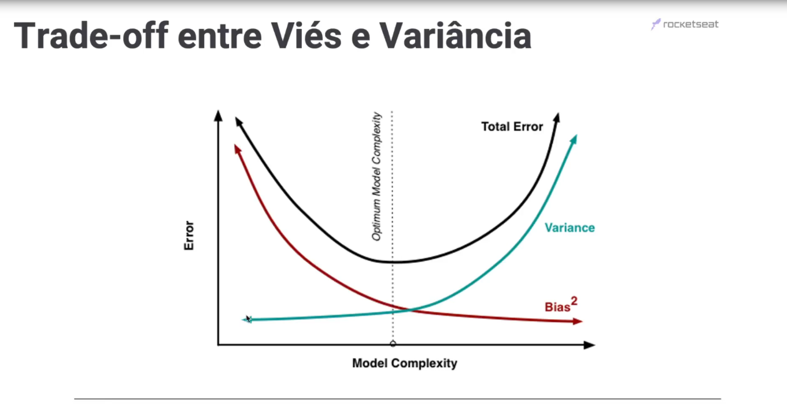

### Conceito ChatGPT 3.5

O trade-off entre viés e variância é um conceito fundamental no contexto de machine learning, e compreender esse equilíbrio é essencial para o desenvolvimento de modelos de aprendizado de máquina eficazes. Vamos explicar o que é viés e variância e como eles estão relacionados:

1. Viés (Bias):
   - O viés refere-se à simplificação excessiva de um modelo, resultando em suposições incorretas sobre os dados. Um modelo com alto viés tende a ser muito simplificado e subajustado aos dados de treinamento.
   - Modelos com alto viés não conseguem capturar a complexidade dos dados e, portanto, têm um desempenho ruim tanto nos dados de treinamento quanto nos dados de teste. Isso é conhecido como underfitting.

2. Variância (Variance):
   - A variância é a sensibilidade de um modelo às flutuações nos dados de treinamento. Modelos com alta variância são muito sensíveis às variações nos dados de treinamento e podem se ajustar demais a esses dados.
   - Modelos com alta variância geralmente têm um desempenho muito bom nos dados de treinamento, mas um desempenho ruim nos dados de teste, porque eles não conseguem generalizar bem para exemplos não vistos. Isso é conhecido como overfitting.

O trade-off entre viés e variância pode ser resumido da seguinte forma:

- Modelos com alto viés tendem a ser muito simples e não capturam a complexidade dos dados. Isso leva a um mau desempenho nos dados de treinamento e nos dados de teste.

- Modelos com alta variância são muito complexos e se ajustam demais aos dados de treinamento, perdendo a capacidade de generalizar para novos dados.

Para encontrar o equilíbrio adequado entre viés e variância, é necessário ajustar a complexidade do modelo. Alguns métodos para alcançar esse equilíbrio incluem:

1. Ajustar a complexidade do modelo: Isso pode ser feito alterando hiperparâmetros, como o número de camadas e unidades em uma rede neural ou a profundidade de uma árvore de decisão.

2. Usar validação cruzada: A validação cruzada permite avaliar o desempenho do modelo em diferentes divisões dos dados de treinamento e ajustar a complexidade com base nesses resultados.

3. Coletar mais dados: Às vezes, o aumento do tamanho do conjunto de dados pode ajudar a reduzir a variância, permitindo que o modelo generalize melhor.

4. Usar técnicas de regularização: Técnicas como regularização L1 e L2 podem ajudar a reduzir a variância, limitando os pesos do modelo.

Em resumo, o trade-off entre viés e variância é um desafio comum em machine learning. Encontrar o equilíbrio certo é fundamental para criar modelos que se ajustem bem aos dados de treinamento e generalizem bem para novos dados.

> [voltar](#sumário) para o topo.

## Validação de Modelos

### Material

A validação de modelos serve para garantir que eles estejam performando de acordo com as expectativas dos usuários.

#### Grupos de Validação de Modelos

1) **Divisão de Conjunto de Dados (Supervisionado)**:
   A divisão de conjunto de dados é uma das técnicas de validação mais simples e amplamente usadas em aprendizado supervisionado. Nessa abordagem, o conjunto de dados é dividido em pelo menos dois subconjuntos: um conjunto de treinamento e um conjunto de teste. O modelo é treinado no conjunto de treinamento e avaliado no conjunto de teste. Isso permite verificar como o modelo se comporta em dados que não foram usados para treinamento. A divisão de dados é uma maneira eficaz de avaliar o desempenho do modelo e detectar problemas como overfitting (ajuste excessivo) ou underfitting (ajuste insuficiente).

2) **Métricas de Desempenho**:
   As métricas de desempenho são usadas para quantificar o quão bem um modelo está executando em tarefas de machine learning. Elas fornecem medidas objetivas do desempenho do modelo, como precisão, recall, precisão, F1-score, AUC-ROC, erro quadrático médio, entre outras. A escolha das métricas de desempenho depende do tipo de problema (classificação, regressão, clustering) e das metas específicas do projeto. Métricas de desempenho ajudam a entender o quão bem o modelo está se saindo em termos de acurácia e eficácia em relação aos dados de teste.

3) **Métricas de Negócio**:
   Embora as métricas de desempenho forneçam informações importantes sobre o desempenho técnico de um modelo, as métricas de negócio são fundamentais para avaliar o impacto prático do modelo em um cenário de negócios ou aplicação. Essas métricas estão diretamente relacionadas aos objetivos de negócios, como lucro, economia de custos, satisfação do cliente, entre outros. As métricas de negócio são mais relevantes para as partes interessadas e ajudam a determinar se o uso do modelo é vantajoso do ponto de vista empresarial.

4) **Questões Não Funcionais**:
   As questões não funcionais envolvem aspectos que não estão diretamente relacionados ao desempenho ou métricas de negócio, mas que são igualmente importantes. Isso inclui questões éticas, legais, de privacidade e de segurança. Por exemplo, é importante garantir que o uso do modelo esteja em conformidade com regulamentos de proteção de dados, não viole a privacidade dos usuários e não perpetue vieses indesejados. Além disso, a segurança do modelo e dos dados deve ser considerada, especialmente em aplicações críticas.

- *Ilustração:* grupos de validação de modelos

  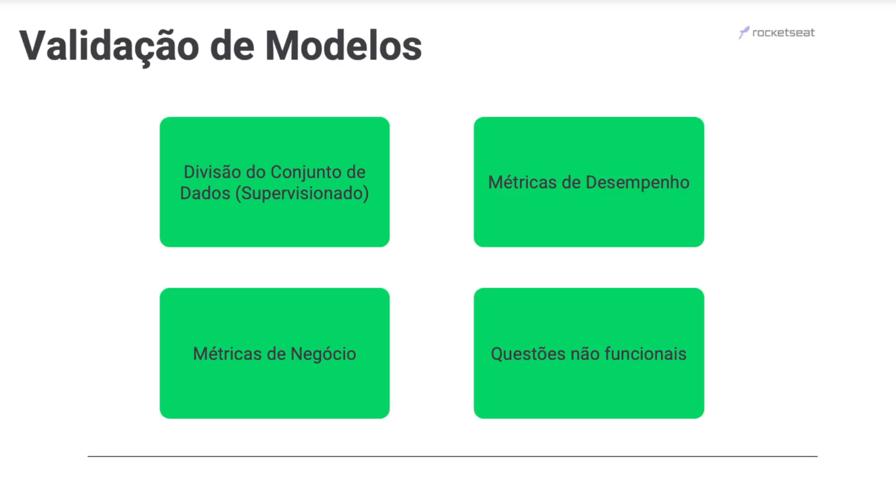

#### Exemplos de Técnicas de Validação de Modelos

- *Ilustração:* técnica *Hold-out*

  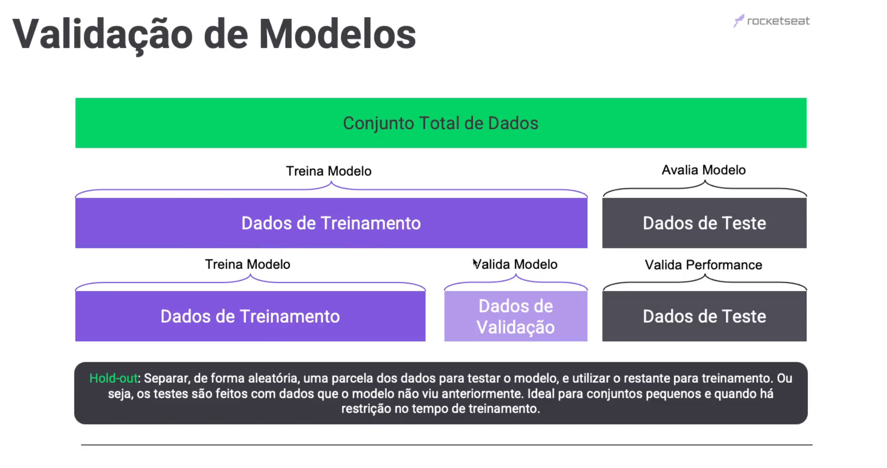

- *Ilustração:* técnica *K-fold*

  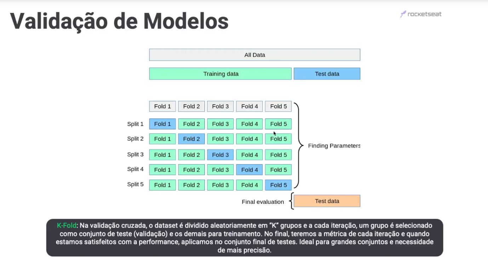

- *Ilustração:* técnica *Stratified K-fold*

  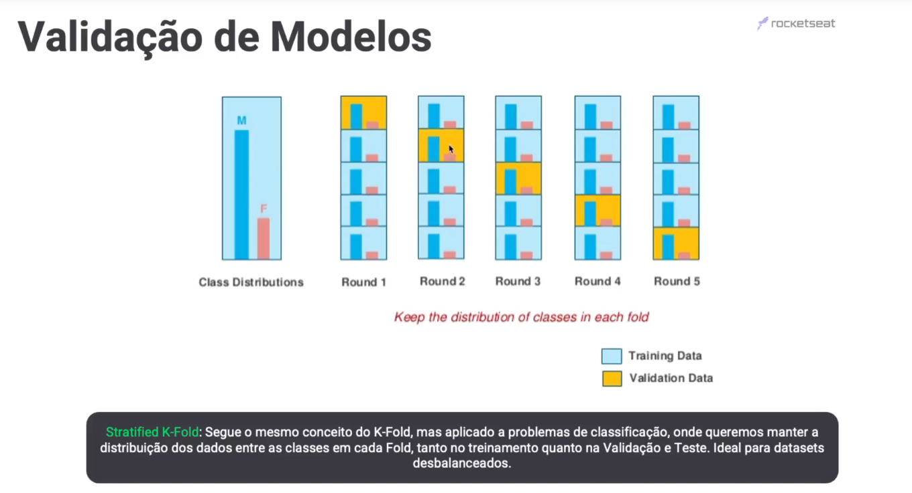

#### Tipos de Métricas de Desempenho e de Negócios

Descrição e exemplos de [**métricas de desempenho**](./bi_performance-metrics.md).

Descrição e exemplos de [**métricas de negócio**](./bii_business-metrics.md).

- *Ilustração 1:* tipo de métricas de desempenho.

  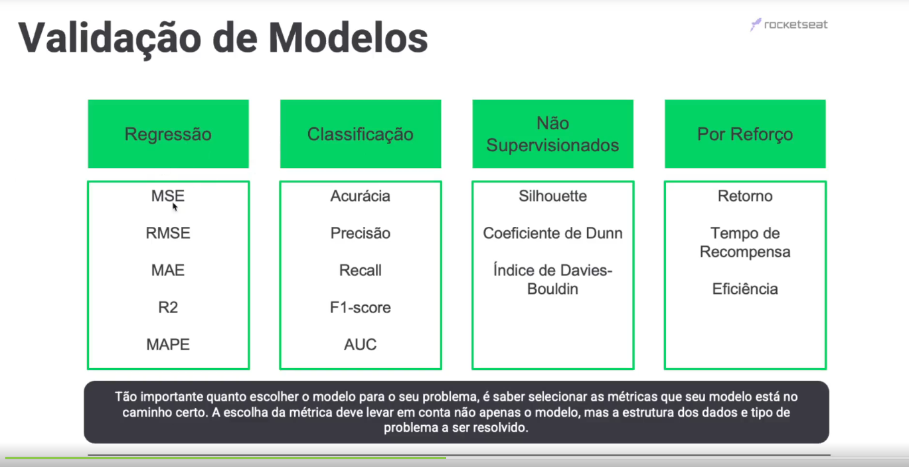

- *Ilustração 2:* tipo de métricas de Negócio.

  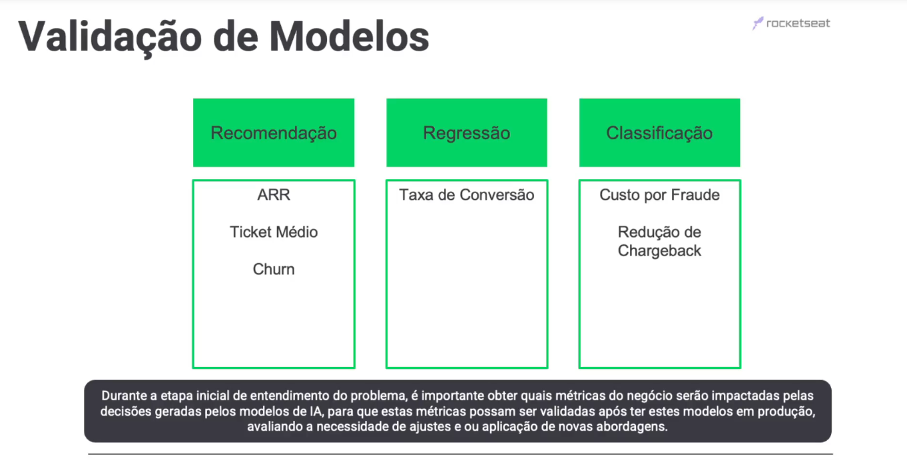

#### Questões não funcionais

Questões não funcionais são aspectos críticos a serem considerados ao validar modelos de machine learning, além do desempenho puramente preditivo. Aqui estão explicações para quatro dessas questões não funcionais no contexto da validação de modelos de machine learning:

1) **Interpretabilidade**: refere-se à capacidade de entender e explicar o funcionamento de um modelo de machine learning. Modelos complexos, como redes neurais profundas, podem ser difíceis de interpretar, o que é um desafio em casos onde a transparência é crucial, como em aplicações médicas ou legais. A interpretabilidade permite que os usuários compreendam as decisões do modelo e confiem mais nele.

2) **Fairness (Equidade):** A equidade é a preocupação de que os modelos de machine learning não reproduzam ou amplifiquem preconceitos existentes na sociedade. Isso significa que os modelos não devem fazer previsões discriminatórias com base em características protegidas, como raça, gênero, orientação sexual, etc. A validação de equidade envolve a detecção e mitigação de viés nos modelos, garantindo que eles tomem decisões justas para todos os grupos.

3) **Eficiência:** está relacionada ao uso de recursos, como tempo e hardware, na implantação de um modelo de machine learning. Modelos muito complexos podem ser lentos ou exigir hardware caro. A validação de eficiência envolve otimizar modelos para que sejam executados rapidamente e com custos operacionais adequados. Isso é particularmente importante em sistemas de tempo real e em ambientes com recursos limitados.

4) **Segurança:** refere-se à proteção dos modelos de machine learning contra ataques maliciosos, como ataques de adversários, envenenamento de dados ou exploração de vulnerabilidades. A validação de segurança envolve a identificação e mitigação de riscos de segurança, como o uso indevido do modelo ou a exposição a ameaças cibernéticas. Garantir a segurança do modelo é fundamental, especialmente em aplicações críticas, como sistemas de segurança e saúde.

Cada uma dessas questões não funcionais desempenha um papel importante na validação de modelos de machine learning, garantindo que esses modelos sejam confiáveis, justos, eficientes e seguros em uma variedade de cenários de aplicação.

- *Ilustração:* principais questões não funcionais.

  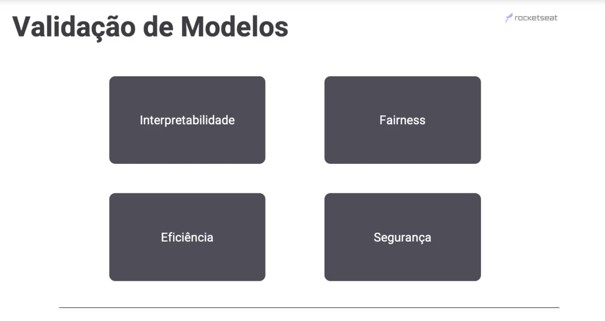

### Conceito ChatGPT 3.5

A validação de modelo é uma parte fundamental do processo de desenvolvimento de modelos de machine learning. Ela envolve a avaliação do desempenho de um modelo para garantir que ele seja capaz de generalizar bem para dados não vistos. A validação de modelo ajuda a determinar quão bem um modelo se ajusta aos dados de treinamento e se é capaz de fazer previsões precisas em novos dados. Existem várias técnicas de validação de modelo que são comumente usadas, incluindo as seguintes:

1. Divisão de dados (split de dados):
   - Nessa técnica, o conjunto de dados é dividido em dois subconjuntos: um conjunto de treinamento e um conjunto de teste. O modelo é treinado no conjunto de treinamento e avaliado no conjunto de teste. Isso permite verificar como o modelo se sai em dados que não foram usados para treinamento.

2. Validação cruzada (cross-validation):
   - A validação cruzada é uma técnica mais avançada que divide o conjunto de dados em várias dobras (folds) e realiza múltiplas iterações de treinamento e teste. Por exemplo, na validação cruzada de k-fold, os dados são divididos em k subconjuntos (folds), e o modelo é treinado k vezes, cada vez usando k-1 folds como conjunto de treinamento e 1 fold como conjunto de teste. Isso ajuda a reduzir o viés na avaliação do modelo, fornecendo uma média das métricas de desempenho em diferentes subconjuntos de dados.

3. Validade externa:
   - Em alguns casos, é importante verificar o desempenho do modelo em um conjunto de dados totalmente diferente, que não tenha sido usado em nenhuma etapa do desenvolvimento do modelo. Isso ajuda a verificar se o modelo é capaz de generalizar bem para dados do mundo real.

As métricas de avaliação comuns usadas na validação de modelo incluem:

- Precisão (accuracy): Mede a proporção de previsões corretas feitas pelo modelo.
- Recall (revocação): Mede a proporção de exemplos positivos que foram corretamente identificados pelo modelo.
- Precisão (precision): Mede a proporção de exemplos identificados como positivos pelo modelo que são realmente positivos.
- F1-score: Uma métrica que combina precisão e recall em uma única medida.
- Área sob a curva ROC (AUC-ROC): Uma métrica que avalia o desempenho do modelo em problemas de classificação binária.
- Erro quadrático médio (Mean Squared Error - MSE): Uma métrica comum para problemas de regressão que mede a média dos quadrados dos erros entre as previsões e os valores reais.

A escolha da técnica de validação e das métricas de avaliação depende do tipo de problema que você está resolvendo e do conjunto de dados em questão. É importante realizar a validação do modelo de forma adequada para garantir que ele seja capaz de tomar decisões precisas e úteis em cenários do mundo real.

> [voltar](#sumário) para o topo.
>
> [voltar](./notes.md) para página anterior.
