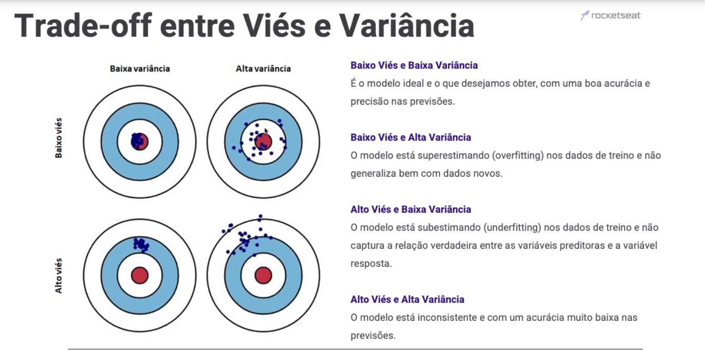

<!-- markdownlint-disable MD024 -->
<!-- markdownlint-disable MD033 -->

# Parte 2 - O cotidiano de projetos de IA/ML

> [voltar](./notes.md) para página anterior.

## Sumário

- [Parte 2 - O cotidiano de projetos de IA/ML](#parte-2---o-cotidiano-de-projetos-de-iaml)
  - [Sumário](#sumário)
  - [A maldição da dimensionalidade](#a-maldição-da-dimensionalidade)
    - [Material](#material)
    - [Conceito ChatGPT 3.5](#conceito-chatgpt-35)
  - [Engenharia e Seleção de *Features*](#engenharia-e-seleção-de-features)
    - [Material](#material-1)
    - [Conceito ChatGPT 3.5](#conceito-chatgpt-35-1)
  - [*Overfitting* e *Underfittig*](#overfitting-e-underfittig)
    - [Material](#material-2)
    - [Conceito ChatGPT 3.5](#conceito-chatgpt-35-2)
  - [Trade-off entre viés e variância](#trade-off-entre-viés-e-variância)
    - [Material](#material-3)
    - [Conceito ChatGPT 3.5](#conceito-chatgpt-35-3)
  - [Validação de Modelos](#validação-de-modelos)
    - [Material](#material-4)
    - [Conceito ChatGPT 3.5](#conceito-chatgpt-35-4)

## A maldição da dimensionalidade

### Material

A **maldição da dimensionalidade** foi denominada pelo matemático R. Bellman em seu livro "Programação Dinâmica", em 1957. Essa maldição diz qua a quantidade de dados que você precisa, para alcançar o conhecimento desejado, impacta exponencialmente o número de atributos necessários.

Em resumo, refere-se a uma série de problemas que surgem ao trabalhar com dados de alta dimensão. A dimensão de um conjunto de dados corresponde ao número de características existens em um conjunto de dados.

- Demonstração:
  - *Gráfico 1:* o aumento de dimensões causa o distancimaneto entre os dados, dificultando a definição de modelos e padrões.
  - *Gráfico 2:* O número de *features*(variáveis) não pode ser ilimitado, sendo necessáio verificar o número ideal de variáveis com o poder computacional.

  

Como lidar com esse problema, então? A ideia é fazer uma seleção apurada da *features* e filtrar o números de dimensões para se evitar o espaçamento dos dados.

### Conceito ChatGPT 3.5

A "maldição da dimensionalidade" é um termo usado no contexto do aprendizado de máquina e da análise de dados para descrever os desafios que surgem quando lidamos com conjuntos de dados de alta dimensionalidade. Refere-se ao fato de que, à medida que o número de características ou dimensões em um conjunto de dados aumenta, vários problemas e dificuldades podem surgir, tornando a análise e o aprendizado de máquina mais complexos. Alguns dos principais desafios associados à maldição da dimensionalidade incluem:

**1. Esparsidade dos dados:** À medida que o número de dimensões aumenta, os pontos de dados em um espaço de alta dimensão tendem a se tornar mais esparsos. Isso significa que a maioria dos pontos de dados está distante uns dos outros, tornando mais difícil identificar padrões significativos.

**2. Aumento da complexidade computacional:** O processamento e a análise de dados de alta dimensão exigem mais recursos computacionais, o que pode tornar os algoritmos de aprendizado de máquina mais lentos e exigir mais memória.

**3. Overfitting:** Com um grande número de dimensões, os modelos de aprendizado de máquina têm maior probabilidade de se ajustar ao ruído nos dados, em vez de capturar os padrões reais. Isso pode levar a um superajuste (overfitting), onde o modelo não consegue generalizar bem para novos dados.

**4. Necessidade de mais dados:** À medida que a dimensionalidade aumenta, é necessário um número cada vez maior de dados para estimar adequadamente os parâmetros do modelo e reduzir o risco de overfitting.

**5. Redução de dimensionalidade:** Para lidar com a maldição da dimensionalidade, muitas vezes é necessário realizar técnicas de redução de dimensionalidade, como Análise de Componentes Principais (PCA) ou seleção de características, a fim de extrair as informações mais importantes e reduzir a dimensionalidade do conjunto de dados.

Espero que esta formatação com negrito torne os tópicos mais destacados. Se você tiver mais alguma pergunta ou precisar de esclarecimentos adicionais, sinta-se à vontade para perguntar.

A maldição da dimensionalidade é um desafio importante a ser enfrentado ao lidar com conjuntos de dados de alta dimensão, e os cientistas de dados e engenheiros de aprendizado de máquina frequentemente precisam adotar estratégias para mitigar seus efeitos e desenvolver modelos eficazes em tais ambientes.

> [voltar](#sumário) para o topo.

## Engenharia e Seleção de *Features*

### Material

Engenharia de *features* é uma etapa fundamental no processo de desenvolvimento de modelos de ***machine learning***. refere-se ao processo de selecionar, extrair, transformar ou criar novas vairáveis (*features*) a partir de dados brutos para melhorar o desempenho de modelos. Uma boa engenharia de *features* pode tornar um modelo mais preciso, eficiente e interpretável.

A engenharia de *features* é um **processo iterativo**. Os especialistas em IA/ML geralmente começam com um conjunto inicial de *features* e então testam diferentes combinações de *features* para determinar a melhor configuração para o modelo.

- *Ilustração*: etapas da Engenharia de *Features*

  

### Conceito ChatGPT 3.5

A "Engenharia de Features" (ou "Engenharia de Características") é um processo fundamental no campo de aprendizado de máquina (machine learning) que envolve a criação, transformação e seleção de características (variáveis) a partir dos dados brutos, a fim de melhorar o desempenho dos modelos de machine learning. As características, também chamadas de atributos ou variáveis, representam informações específicas que o modelo usa para fazer previsões ou classificações. Aqui está o conceito e as etapas típicas da Engenharia de Features:

**Conceito da Engenharia de Features:**
A Engenharia de Features é o processo de identificar, criar e modificar características relevantes a partir dos dados brutos, a fim de melhorar a capacidade do modelo de aprendizado de máquina de capturar padrões, fazer previsões precisas e generalizar bem para novos dados. É uma etapa crítica no desenvolvimento de modelos de machine learning, pois a qualidade e a relevância das características têm um grande impacto no desempenho do modelo.

**Etapas da Engenharia de Features:**

1. **Coleta de Dados:** A primeira etapa envolve a aquisição dos dados brutos. Isso pode incluir a coleta de dados de fontes diversas, como sensores, bancos de dados, arquivos CSV, etc.

2. **Análise Exploratória de Dados (EDA):** Antes de criar ou modificar características, é essencial realizar uma análise exploratória dos dados para entender sua estrutura, distribuição e identificar possíveis padrões iniciais. Isso ajuda na escolha das abordagens de engenharia de features mais adequadas.

3. **Seleção de Características:** Nesta etapa, você pode determinar quais características são mais relevantes para o problema em questão. A seleção de características envolve a escolha das características que mais contribuem para o desempenho do modelo e a remoção das características redundantes ou irrelevantes.

4. **Criação de Características:** Aqui, você pode criar novas características a partir das características existentes ou dos dados brutos. Isso pode incluir transformações matemáticas, combinação de características, extração de informações úteis, e assim por diante.

5. **Normalização e Padronização:** Em muitos casos, é importante normalizar ou padronizar as características para garantir que todas estejam na mesma escala, o que ajuda a evitar que algumas características dominem outras durante o treinamento do modelo.

6. **Lidar com Valores Ausentes:** Se houver valores ausentes nos dados, é necessário decidir como tratá-los, seja preenchendo-os com valores apropriados, removendo as instâncias correspondentes ou usando técnicas mais avançadas, como a imputação.

7. **Engenharia de Features Avançada:** Dependendo do problema, você pode aplicar técnicas avançadas, como redução de dimensionalidade (por exemplo, PCA), codificação de variáveis categóricas, criação de características de interação, entre outras.

8. **Avaliação e Iteração:** Após a engenharia de features, é importante avaliar o desempenho do modelo usando validação cruzada e métricas adequadas. Se o desempenho não for satisfatório, você pode iterar nas etapas anteriores, ajustando ou criando novas características, até obter resultados aceitáveis.

A Engenharia de Features é uma parte crucial do ciclo de desenvolvimento de modelos de machine learning, pois pode fazer a diferença entre um modelo com baixo desempenho e um modelo altamente eficaz. É importante adaptar as etapas de engenharia de features de acordo com o problema específico que você está abordando.

> [voltar](#sumário) para o topo.

## *Overfitting* e *Underfittig*

### Material

- *Ilustração:* conceitos e modelos clássicos *under*, *optimum* e *overfit*

  

Como lidar *overfitting* e *underfittig*? Existem técnicas para lidar com esses problemas, como a regularização, o uso de ensemble de modelos, a seleção de boas features e a redução da dimensionalidade dos dados. A validação cruzada também é uma técnica importante para evitar o overfitting e o underfitting.

### Conceito ChatGPT 3.5

O overfitting e o underfitting são problemas comuns no treinamento de modelos de machine learning e referem-se a situações em que o modelo não é capaz de generalizar bem para novos dados. Aqui estão as estratégias típicas para lidar com esses dois problemas:

**Overfitting:**
O overfitting ocorre quando um modelo se ajusta excessivamente aos dados de treinamento, capturando o ruído nos dados em vez dos padrões reais. Isso resulta em um desempenho fraco em novos dados. Para lidar com o overfitting, você pode considerar as seguintes estratégias:

1. **Aumentar o tamanho do conjunto de dados:** Um conjunto de dados maior pode ajudar o modelo a aprender padrões mais gerais e reduzir o impacto do ruído nos dados.

2. **Regularização:** A regularização adiciona penalidades aos coeficientes do modelo para evitar que eles cresçam demais. Isso inclui técnicas como L1 (Lasso) e L2 (Ridge) para regressão linear, ou dropout em redes neurais.

3. **Seleção de Características:** Reduza o número de características no modelo, mantendo apenas as mais informativas. A seleção de características pode ajudar a evitar que o modelo se ajuste ao ruído.

4. **Cross-Validation:** Use validação cruzada para avaliar o desempenho do modelo em conjuntos de treinamento e teste diferentes. Isso ajuda a identificar se o modelo está superajustando os dados.

5. **Diminuir a complexidade do modelo:** Escolha modelos mais simples com menos parâmetros. Às vezes, modelos complexos, como redes neurais profundas, são mais suscetíveis ao overfitting.

6. **Aumentar a Regularização:** Ajuste os hiperparâmetros de regularização, como a força da penalização em modelos lineares ou a taxa de dropout em redes neurais.

**Underfitting:**
O underfitting ocorre quando o modelo é muito simples para capturar os padrões nos dados de treinamento, resultando em um desempenho insatisfatório. Para combater o underfitting, você pode adotar as seguintes abordagens:

1. **Aumentar a Complexidade do Modelo:** Considere modelos mais complexos, como aumentar o número de camadas ou unidades em uma rede neural, ou usar modelos mais flexíveis, se for apropriado.

2. **Aumentar o Tamanho do Conjunto de Dados:** Um conjunto de dados maior pode fornecer mais informações para o modelo aprender os padrões subjacentes.

3. **Engenharia de Features:** Crie ou modifique características para tornar os padrões mais evidentes para o modelo.

4. **Reduzir o Nível de Regularização:** Se você estiver usando técnicas de regularização, como L1 ou L2, pode ser necessário reduzir a força da penalização.

5. **Ajustar Hiperparâmetros:** Experimente diferentes configurações de hiperparâmetros, como a taxa de aprendizado, o número de épocas de treinamento ou a arquitetura do modelo, para encontrar a configuração mais adequada.

6. **Validação Cruzada:** Use a validação cruzada para avaliar o desempenho do modelo e ajustar seus hiperparâmetros.

Em resumo, lidar com o overfitting envolve reduzir a complexidade do modelo e controlar o ajuste excessivo, enquanto lidar com o underfitting envolve aumentar a complexidade do modelo e garantir que ele seja capaz de capturar padrões nos dados. A escolha das estratégias apropriadas dependerá do problema e dos dados específicos com os quais você está trabalhando.

> [voltar](#sumário) para o topo.

## Trade-off entre viés e variância

### Material

- *Ilustração*: combinações entre viés e variância

  

- *Gráfico*: padrão de relação entre complexidade de modelo e erro de variância

  

### Conceito ChatGPT 3.5

> [voltar](#sumário) para o topo.

## Validação de Modelos

### Material

### Conceito ChatGPT 3.5

> [voltar](#sumário) para o topo.
>
> [voltar](./notes.md) para página anterior.
