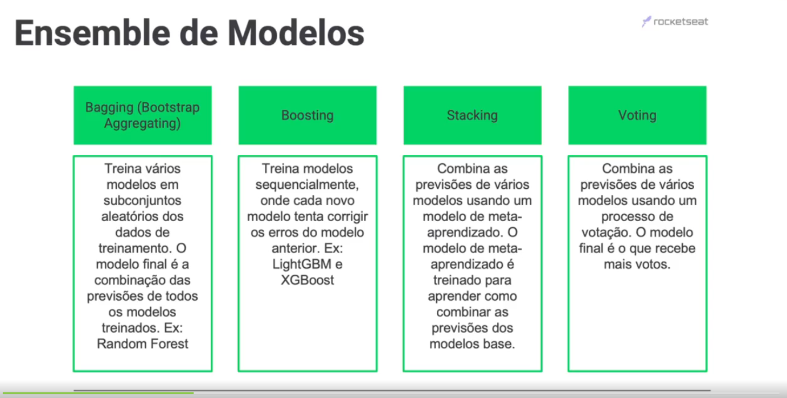
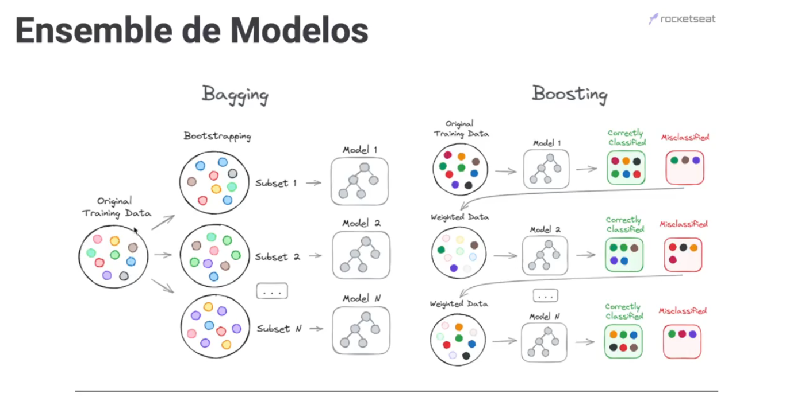
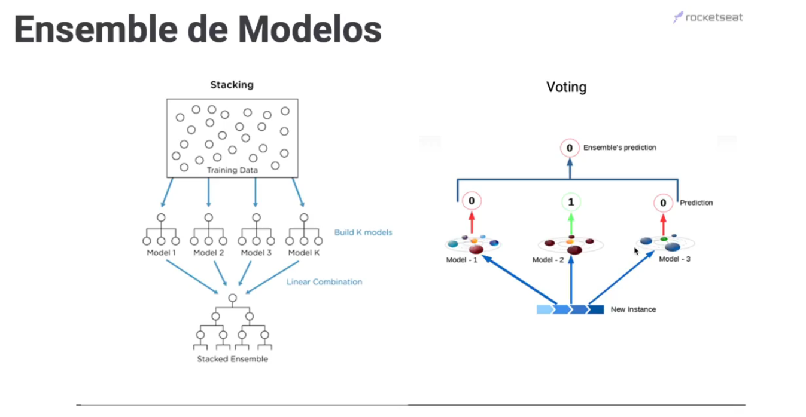
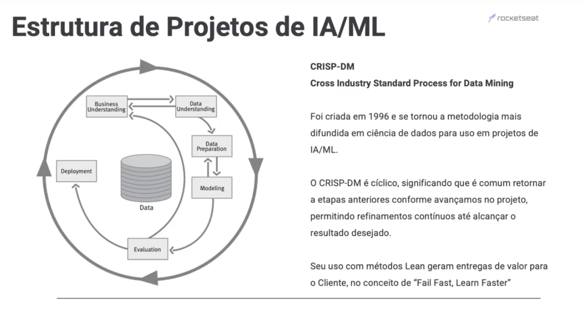
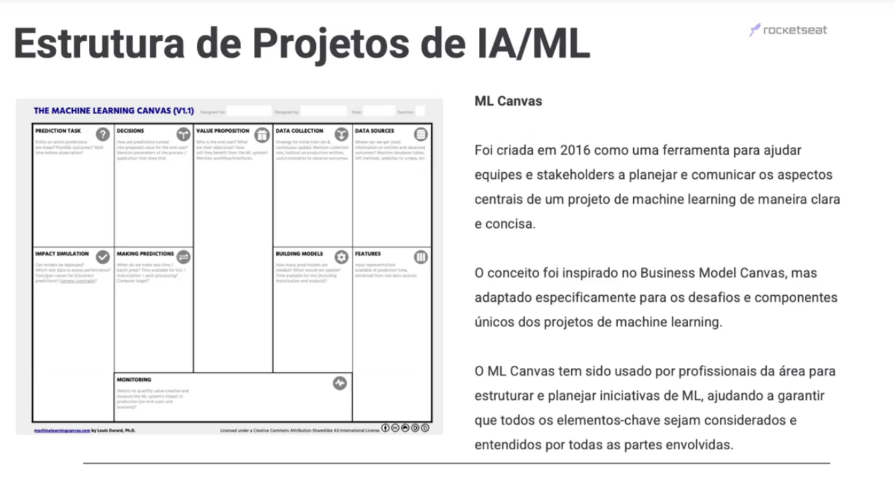
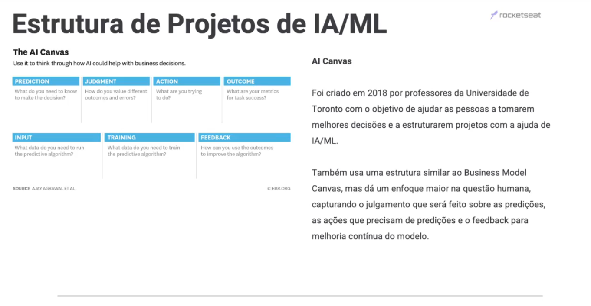

<!-- markdownlint-disable MD024 -->
<!-- markdownlint-disable MD033 -->

# Parte 3 - Tópicos Avançados

> [voltar](./notes.md) para página anterior.

## Sumário

- [Parte 3 - Tópicos Avançados](#parte-3---tópicos-avançados)
  - [Sumário](#sumário)
  - [*Ensemble* de modelos](#ensemble-de-modelos)
    - [Material](#material)
    - [Conceito ChatGPT 3.5](#conceito-chatgpt-35)
  - [Estrutura de projetos IA/ML](#estrutura-de-projetos-iaml)
    - [Material](#material-1)
    - [Conceito ChatGPT 3.5](#conceito-chatgpt-35-1)

## *Ensemble* de modelos

### Material

*Ensemble* de modelos é um técnica de aprendizado de máquina que combina as previsões de vários modelos para melhorar o desembpenho geral. Essa técnica é baseada no princípio de que a combinação de modelos pode ajudar a reduzir o viés e a variância, o que pode livar a previsões mais precisas.

Essas técnicas são frequentemente utilzadas em competições de aprendizado de máquinas, onde a combinação de modelos pode dar uma vantágem crítica. No entanto, vale a pena notar que *ensembles* podem aumentar a complexidade e o tempo de treinamento, portanto, é sempre bom considerar o trade-oof entre performance e complexidade.

- *Ilustração 1:* tipos de *ensemble* de modelos

  

- *Ilustração 2:* exemplos de *bagging* e *boosting*

  

- *Ilustração 3:* exemplos de *staking e *voting*

  

### Conceito ChatGPT 3.5

Ensemble de modelos, no contexto de machine learning, refere-se a uma técnica em que vários modelos de aprendizado de máquina são combinados para melhorar o desempenho e a robustez da previsão ou classificação. A ideia por trás dos ensembles é que, ao combinar as previsões de vários modelos, é possível reduzir os erros individuais dos modelos e, assim, obter resultados mais precisos e confiáveis.

Existem várias abordagens para a criação de ensembles, sendo as mais comuns as seguintes:

1. **Média de votos (Voting):** Nesse método, vários modelos independentes são treinados com os mesmos dados e, em seguida, suas previsões são combinadas por meio de votação, média ou média ponderada. Isso é especialmente eficaz quando os modelos individuais têm desempenhos semelhantes.

2. **Bagging (Bootstrap Aggregating):** Bagging envolve o treinamento de múltiplos modelos (geralmente do mesmo tipo) em diferentes conjuntos de dados de treinamento, que são obtidos por amostragem com substituição a partir do conjunto de dados original. Um exemplo bem conhecido é o algoritmo Random Forest, que é uma técnica de bagging baseada em árvores de decisão.

3. **Boosting:** O boosting é uma técnica em que os modelos são treinados sequencialmente, e os modelos subsequentes são ajustados para corrigir os erros cometidos pelos modelos anteriores. Algoritmos populares de boosting incluem AdaBoost, Gradient Boosting e XGBoost.

4. **Stacking:** Stacking envolve o treinamento de diferentes modelos base, que são então combinados em um modelo de nível superior que faz previsões com base nas saídas dos modelos base. Isso permite que os modelos base complementem uns aos outros e forneçam previsões mais precisas.

Ensembles são frequentemente usados em competições de aprendizado de máquina, como o Kaggle, e em cenários do mundo real, onde a precisão das previsões é de extrema importância. Eles são uma estratégia poderosa para melhorar o desempenho do modelo, reduzir o overfitting e aumentar a estabilidade das previsões. No entanto, também podem ser computacionalmente mais caros, já que envolvem o treinamento de vários modelos. A escolha do método de ensemble e dos modelos base depende do problema específico e dos dados disponíveis.

## Estrutura de projetos IA/ML

### Material

A adoção de uma metodologia para projetos de IA/ML é essencial para estruturar e padronizar o processo de desenvolvimento, assegurando que cada fase seja abordada de forma sistemárica e abranjente. Uma abordagem médica não facilita a identificação e correção de falhas, como o *overfitting*, mas também promove a reprodutibilidade, permitindo que outros cientistas e engenheiros de dados repliquem seus trabalhos com facilidade.

Além disso, essa estruturação otimiza a iteração e o aprimoramento do modelo, e facilita a docmunetação e a comunicação entre as partes interessadas, garantindo transparência, colaboração e eficiência durante todo o ciclo do projeto.

- *Ilustração 1:* CRISP-DM

  

- *Ilustração 2:* ML Canvas

  

- *Ilustração 3:* AI Canvas

  

### Conceito ChatGPT 3.5

Um projeto de Inteligência Artificial (IA) ou Machine Learning (ML) segue geralmente uma estrutura padrão que envolve várias etapas. Essas etapas ajudam a garantir que o projeto seja bem planejado, executado com sucesso e produza resultados úteis. Aqui está uma visão geral da estrutura típica de um projeto de IA/ML:

1. **Definição do Problema:**
   - Nesta fase, você define claramente o problema que deseja resolver com IA/ML. É importante entender os objetivos do projeto, o contexto do problema e os requisitos específicos.

2. **Coleta de Dados:**
   - Reúna os dados relevantes necessários para treinar e testar seu modelo. Isso pode envolver a aquisição de conjuntos de dados, web scraping, integração de fontes de dados, entre outros.

3. **Pré-processamento de Dados:**
   - Os dados coletados geralmente precisam ser limpos e pré-processados. Isso inclui lidar com valores ausentes, normalizar dados, codificar variáveis categóricas e dividir os dados em conjuntos de treinamento e teste.

4. **Exploração de Dados:**
   - Realize uma análise exploratória dos dados para obter insights. Visualize os dados, calcule estatísticas descritivas e identifique padrões ou correlações importantes.

5. **Seleção e Engenharia de Recursos:**
   - Escolha quais recursos (variáveis) usar em seu modelo e, se necessário, crie novos recursos que possam ser mais informativos para a tarefa.

6. **Seleção do Modelo:**
   - Escolha o algoritmo de aprendizado de máquina apropriado com base no tipo de problema (classificação, regressão, clustering, etc.) e nos requisitos específicos do projeto. Experimente vários modelos, se necessário.

7. **Treinamento do Modelo:**
   - Treine o modelo selecionado usando o conjunto de treinamento. Isso envolve ajustar os parâmetros do modelo para minimizar a função de perda.

8. **Avaliação do Modelo:**
   - Avalie o desempenho do modelo usando o conjunto de teste ou validação cruzada. Métricas como precisão, recall, F1-score, erro quadrático médio, etc., são usadas para avaliar o quão bem o modelo está funcionando.

9. **Ajuste de Hiperparâmetros:**
   - Refine o modelo ajustando os hiperparâmetros, como taxa de aprendizado, número de árvores em um Random Forest, profundidade da rede neural, etc. Isso ajuda a otimizar o desempenho do modelo.

10. **Validação do Modelo:**
    - Realize uma validação final do modelo em um conjunto de teste separado, se possível. Isso ajuda a garantir que o modelo não esteja superajustado aos dados de treinamento.

11. **Implantação do Modelo:**
    - Uma vez satisfeito com o desempenho do modelo, implante-o em um ambiente de produção. Isso pode envolver a criação de APIs, aplicativos, ou integração em sistemas existentes.

12. **Monitoramento e Manutenção:**
    - Monitorar o desempenho do modelo em produção é essencial. Os modelos de ML podem degradar ao longo do tempo, à medida que os dados de entrada mudam. Portanto, é importante manter e atualizar os modelos conforme necessário.

13. **Documentação:**
    - Mantenha documentação abrangente de todo o projeto, incluindo a descrição do problema, os dados usados, o processo de pré-processamento, os modelos utilizados e os resultados obtidos.

14. **Comunicação de Resultados:**
    - Comunique os resultados e insights do projeto para as partes interessadas, usando visualizações, relatórios ou apresentações. Certifique-se de que os resultados sejam compreensíveis e úteis.

Esta é uma estrutura geral de um projeto de IA/ML, e as etapas podem variar dependendo do problema específico e das necessidades da organização. Cada etapa requer atenção cuidadosa e expertise em aprendizado de máquina para garantir um projeto de sucesso.

> [voltar](#sumário) para o topo.
>
> [voltar](./notes.md) para página anterior.
